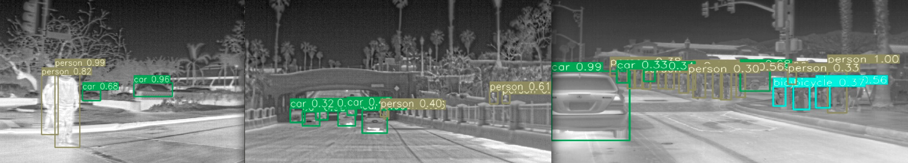
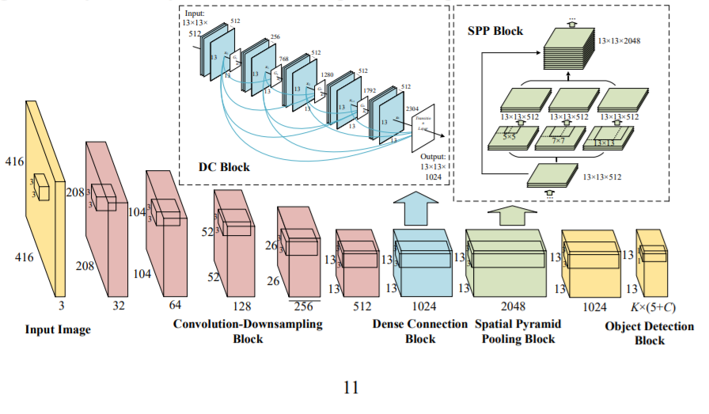

## Object Detection on Thermal Images
Robust Object Classification of Occluded Objects in Forward Looking Infrared (FLIR) Cameras using Ultralytics YOLOv3 and Dark Chocolate. <strong><em>Medium Article that compliments code repo:</em></strong> [Article on Medium](https://medium.com/@joehoeller/object-detection-on-thermal-images-f9526237686a)



#### Production Grade Results

   1. <strong>mAP:</strong> ```0.961```
   2. <strong>Recall:</strong> ```0.922```
   3. <strong>F1:</strong> ```0.857```
   


#### Downloads needed to run codebase
  
   1. Download pre-trained weights here: [link](https://drive.google.com/drive/folders/1dV0OmvG4eZFtnh5WF0mby-jhkVy-HVco?usp=sharing)
   
   2. FLIR Thermal Images Dataset: [Download](https://www.flir.com/oem/adas/adas-dataset-form/)

   3. Go into ```/data``` folder and unzip ```labels.zip```
   
   4. Addt'l instructions on how to run [Ultralytics Yolov3](https://github.com/ultralytics/yolov3)

#### Instructions

- Must have NVIDIA GPUs with Turing Architecture, Ubuntu and CUDA X installed if you want to reproduce results.

- Add the data provided by FLIR to a folder path called ```/coco/FLIR_Dataset```. 

- Place the custom pre-trained weights you downloaded from above into: ```/weights/*.pt``` 

- Converted labels from [Dark Chocolate](https://github.com/joehoeller/Dark-Chocolate) are located in data/labels, which you unzipped above.

- The custom *.cfg with modified hyperparams is located in ```/cfg/yolov3-spp-r.cfg```.

- Class names and custom data is in ```/data/custom.names``` and ```custom.data```.


#### Install & Run Code:

After download is complete run pip install requirements, or click into the requriements.txt file for the Anaconda commands.
Install COCO: ``` bash yolov3/data/get_coco_dataset.sh```, then add FLIR images to: ```/coco/images/FLIR_Dataset```. Select any random grouping of non-annotated images, (ctrl-click any random sample of 5 to 10, or 20 if you like), copy them, and them paste them into data/samples folder.

- Go back to the root of the project where the requirements.txt file is and open a command prompt, run the following:

$  ```python3 detect.py --data data/custom.data --cfg cfg/yolov3-spp-r.cfg --weights weights/custom.pt```

<strong>Modified config in ```yolov3-spp-r.cfg``` file; Leverages Spatial Pyramid Pooling with Ultralytics YOLOv3 for better feature extraction and higher precision on thermal images.</strong>

<em>See Convolutional Neural Network Architecture below:</em>



- At the root of the project, you will then see a folder named output get generated with annotated images and bounding boxes around the objects within the images you chose for the ``data/samples`` folder.

- To get metrics, go back into command line at root of project and run: 

  $ ```python (python cmd prompt)```
  
  $ ```from utils import utils```
  
  $ ```utils.plot_results()```
  

You will then see an image of charts get generated at root of project called results.png

- To get class-wise scores run ( * Note that ```-r``` /yolov3-spp-r.cfg is the altered CNN architecture):

$ ```python3 test.py --cfg cfg/yolov3-spp-r.cfg --weights weights/custom.pt --data data/custom.data```


#### Need consulting to better understand computer vision implmentation for better business outcomes?
If Artifical Intelligence Applications are important to you or your business, please get in [touch](https://www.linkedin.com/in/computer-vision-engineer/) or email ```joehoeller@gmail.com```.

#### Consulting ideas on which this production-grade project could be forked to for real-word use cases:

 - *Search and Rescue for Public Safety:* Object Classification in Thermal Images using Convolutional Neural Networks for Search and Rescue Missions (SAR) with Unmanned Aerial Systems (UAS).

 - *Defense and Aerospace: Detecting IEDs (Improvised Explosive Devices):* in live combat war zones.
Self-Driving Cars: Autonomous vehicles, personal or commercial.

 - *Industrial Applications:* Electrical grid monitoring, wind power, and oil refinery monitoring.
 
 - *Improved Breast Cancer Screening & Detection:* Automated analysis of tumor segmentation in thermal images using artificial intelligence increases the accuracy of detecting breast cancer, and enables use in breast cancer screening programs.

 - *Segmentation of Industrial Material types for automated assembly lines:* Deep Thermal Imaging for material type recognition of Spatial Surface Temperature Patterns (SSTP).

 - *Sense and Detect Active School Shooters:* Ensemble with Doppler signal processing methods for Concealed Weapon Detection in a Human Body by Infrared Imaging.
 

 - *NASA/ESA Land Rovers (e.g.; Mars Exploration Rovers (MER) Spirit and Opportunity):* Fork GitHub repo and customize to measure heat signatures from various extraterrestrial objects. This will allow one to determine what materials/composites are in these objects. Also allows (martian) rover to further explore extra-terrestrial planets while identifying objects we cannot see in normal spectrum.


